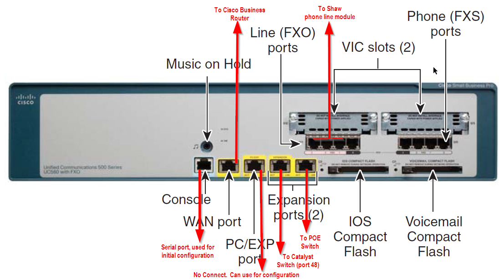

# Cisco UC560 Phone Server
Our phones connect to a Cisco UC560 server.

## Front Panel view

{ width=100% }

## VLANs and server IP
The factory defaults were maintained.  There are 3 VLANS:

### VLAN1
Server IP: 192.168.10.1

This is "Phone Data".  Do not confuse with the ElmTree Data VLAN.  Computers that connect via the desktop phones will get this subnet.

### VLAN90
Server IP: 10.1.20.2  

This seems to be used for TFTP for the client phones

### VLAN100
Server IP: 10.1.1.1 

This is the subnet the phones connect to.  